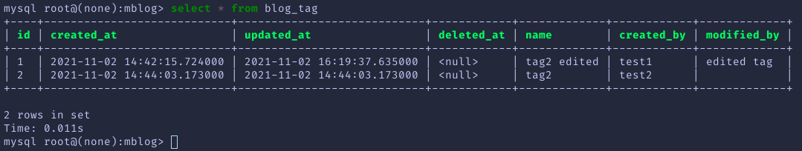

# go-blog

## 框架搭建

<div align=center></div>

```bash
conf: 配置信息
controllers: 控制器
dao: data access object 数据访问层
models: 模型层
logic: 业务逻辑层
pkg: 引用包
router: 路由层
setting: 初始化配置信息
```

上方图缺少逻辑层, 创建 logic 文件夹即可.

## 项目初始化 (加载配置, mysql, router etc.)

### 编写配置文件

```yaml
# conf/config.yaml
app:
  jwt_secret: "23347$040412"
  run_mode: "debug"
  page_size: 10

server:
  http_port: 8039
  read_timeout: 60
  write_timeout: 60

mysql:
  user: "user"
  password: "password"
  host: "121.x0.xxx.71:3306"
  db_name: "blog"
  table_prefix: "blog_"
  max_open_conns: 200
  max_idle_conns: 50
  max_life_time: 3600 # 60 * 60s = 3600s
```

### 根据配置文件写对应的 go 结构体

```go
// conf/config.go

package conf

var Conf = new(Config)

type Config struct {
	*AppConf `mapstructure:"app"`
	*MysqlConf  `mapstructure:"mysql"`
	*ServerConf `mapstructure:"server"`
}

type AppConf struct {
	RunMode   string  `mapstructure:"run_mode"`
	JwtSecret string  `mapstructure:"jwt_secret"`
	PageSize  int     `mapstructure:"page_size"`
}

type ServerConf struct {
	HttpPort     int `mapstructure:"http_port"`
	ReadTimeout  int `mapstructure:"read_timeout"`
	WriteTimeout int `mapstructure:"write_timeout"`
}

type MysqlConf struct {
	User         string `mapstructure:"user"`
	Password     string `mapstructure:"password"`
	Host         string `mapstructure:"host"`
	DbName       string `mapstructure:"db_name"`
	TablePrefix  string `mapstructure:"table_prefix"`
	MaxOpenConns int    `mapstructure:"max_open_conns"`
	MaxIdleConns int    `mapstructure:"max_idle_conns"`
	MaxLifeTime  int    `mapstructure:"max_life_time"`
}
```

所有的配置被放在一个 Conf 结构体中, 每个模块的配置被嵌套其中. 注意使用 mapstructure 的 tag.

### 使用 viper 读取配置文件

```go
// setting/setting.go
package setting

import (
	"blog/conf"
	"fmt"

	"github.com/fsnotify/fsnotify"
	"github.com/spf13/viper"
)

func Init(configPath string) (err error) {
	viper.SetConfigFile(configPath) // 直接指定配置文件 ’/path + name + suffix

	//viper.SetConfigName("config")
	//viper.SetConfigType("yaml")
	//viper.AddConfigPath(".")

	// 读取配置
	if err = viper.ReadInConfig(); err != nil {
		panic(fmt.Errorf("Fatal error config file: %w \n", err))
	}

	// 解析成结构体
	if err = viper.Unmarshal(conf.Conf); err != nil {
		fmt.Println("Read Config failed\n", err)
	}

	// 热加载配置
	viper.WatchConfig()

	viper.OnConfigChange(func(e fsnotify.Event) {
		fmt.Println("Config was Changed: ", e.Name)
	})

	if err := viper.Unmarshal(conf.Conf); err != nil {
		fmt.Println("Read Config failed\n", err)
	}
	return

}
```

### 初始化 viper

```go
// main.go
package main

import (
	"blog/setting"
)

func main() {
	if err := setting.Init("./conf/config.yaml"); err != nil {
		panic(err)
	}
}

```

没有报错则成功初始化 viper, 这里先将配置文件目录写死， 之后可以使用 flag 包从命令行进行读取.

### MySQL

```go
// dao/mysql/mysql.go
package mysql

import (
	"blog/conf"
	"fmt"
	"log"
	"time"

	"github.com/jmoiron/sqlx"
	"gorm.io/driver/mysql"
	"gorm.io/gorm"
)

var db *gorm.DB
var dbx *sqlx.DB

func Init(config *conf.MysqlConf) (err error) {
	dsn := fmt.Sprintf("%s:%s@tcp(%s)/%s?charset=utf8mb4&parseTime=True",
		config.User,
		config.Password,
		config.Host,
		config.DbName,
	)

	if db, err = gorm.Open(mysql.Open(dsn), &gorm.Config{}); err != nil {
		log.Println("connect to mysql failed")
		return
	}

	dbx, err := db.DB()
	// SetMaxIdleConns sets the maximum number of connections in the idle connection pool.
	dbx.SetMaxIdleConns(config.MaxIdleConns)

	// SetMaxOpenConns sets the maximum number of open connections to the database.
	dbx.SetMaxOpenConns(config.MaxOpenConns)

	// SetConnMaxLifetime sets the maximum amount of time a connection may be reused.
	dbx.SetConnMaxLifetime(time.Duration(config.MaxLifeTime))

	return
}
```

db 为 gorm 中的数据库， 但在其底层维护这一个\*sqlx.DB， 这里的 sqlx 用来设置最大空闲与连接等等特性，实际中使用仍是用 db.

### 初始化数据库

```go
// main.go
package main

import (
	"blog/conf"
	"blog/dao/mysql"
	"blog/setting"
)

func main() {
	// 初始化viper， 获取配置文件
	if err := setting.Init("./conf/config.yaml"); err != nil {
		panic(err)
	}

	// 初始化mysql
	if err := mysql.Init(conf.Conf.MysqlConf); err != nil {
		panic(err)
	}
}
```

### 路由

```go
// router/router.go
package router

import (
	"blog/conf"
	"net/http"

	"github.com/gin-gonic/gin"
)

func RouterSetup() *gin.Engine {

	r := gin.New()
	r.Use(gin.Logger(), gin.Recovery())
	gin.SetMode(conf.Conf.AppConf.RunMode)

	r.GET("/ping", func(c *gin.Context) {
		c.String(http.StatusOK, "pong")
	})

	return r
}
```

### 初始化路由

```go
// main.go
package main

import (
	"blog/conf"
	"blog/dao/mysql"
	"blog/router"
	"blog/setting"
	"fmt"
	"net/http"
)

func main() {
	// 初始化viper， 获取配置文件
	if err := setting.Init("./conf/config.yaml"); err != nil {
		panic(err)
	}

	// 初始化mysql
	if err := mysql.Init(conf.Conf.MysqlConf); err != nil {
		panic(err)
	}

	// 初始化router
	r := router.RouterSetup()

	server := &http.Server{
		Addr:    fmt.Sprintf(":%d", conf.Conf.ServerConf.HttpPort),
		Handler: r,
		//ReadTimeout:    time.Duration(conf.Conf.ServerConf.ReadTimeout),
		//WriteTimeout:   time.Duration(conf.Conf.ServerConf.WriteTimeout),
		MaxHeaderBytes: 1 << 20,
	}

	server.ListenAndServe()
}
```

访问 http://127.0.0.1:8039/ping 得到 "pong", 则成功初始化 router. 端口号取决于 config.yaml 中指定的端口号.

至此， 项目初始化完毕.

项目的目录树：

<div align=center></div>

## 编写 tag 接口

### 定义 tag 的结构体

```go
// models/tag.go
package models

import (
	"blog/conf"
	"time"

	"gorm.io/gorm"
)

type Tag struct {
	gorm.Model
	Name       string `json:"name"`
	CreatedBy  string `json:"created_by"`
	ModifiedBy string `json:"modified_by"`
	State      int    `json:"state" gorm:"default:1"`
}

// TableName 会将 Tag 的表名重写为 `prefix+Tag`
func (Tag) TableName() string {
	return conf.Conf.MysqlConf.TablePrefix + "tag"
}

func (tag *Tag) BeforeCreate(tx *gorm.DB) error {
	tx.Set("CreatedOn", time.Now().Unix())
	return nil
}

func (*Tag) BeforeUpdate(tx *gorm.DB) (err error) {
	tx.Set("ModifiedOn", time.Now().Unix())
	return nil
}
```

TableName 可以 改变 gorm 建表时的约定, automigrate 后， gorm 为我们创建出的表明为 prefix + "tag", 这里为 blog_tag.

另外两个函数为 gorm 的钩子函数 (hook function), 创建数据库数据之前, 与更新之前会自动调用.

### 定义 tag 相关的控制器

```go
// controllers/v1/tag.go
package v1

import (
	"github.com/gin-gonic/gin"
)

//获取多个文章标签
func GetTags(c *gin.Context) {

}

//获取特定id的文章标签
func GetTag(c *gin.Context) {

}

//新增文章标签
func AddTag(c *gin.Context) {
}

//修改文章标签
func EditTag(c *gin.Context) {
}

//删除文章标签
func DeleteTag(c *gin.Context) {
}
```

这里是我们的 v1 版本, 这样分配文件目录便于以后可能的升级.

### 定义 tag 相关的 router

```go
// router/router.go
package router

import (
	"blog/conf"
	v1 "blog/controllers/v1"

	"github.com/gin-gonic/gin"
)

func RouterSetup() *gin.Engine {

	r := gin.New()
	r.Use(gin.Logger(), gin.Recovery())
	gin.SetMode(conf.Conf.AppConf.RunMode)

	apiV1 := r.Group("/api/v1")
	{
		// tags
		apiV1.GET("/tags", v1.GetTags)          // 获取多个tag
		apiV1.GET("/tags/:id", v1.GetTag)       // 获取特定id的tag
		apiV1.POST("/tags", v1.AddTag)          // 创建一个tag
		apiV1.PUT("/tags/:id", v1.EditTag)      // 修改tag
		apiV1.DELETE("/tags/:id", v1.DeleteTag) // 删除tag

	}
	return r
}
```

### 实现 tag 控制器层

数据的流向: controller (业务的入口) -> logic (处理业务逻辑) -> dao (数据的访问与持久化)

在实现接口之前, 我们需要定义一些 error code 来代指可能出现的 error.

```go
// pkg/e/code.go
package e

const (
	SUCCESS        = 200
	ERROR          = 500
	INVALID_PARAMS = 400

	// tag
	ERROR_EXIST_TAG     = 10001
	ERROR_NOT_EXIST_TAG = 10002
)

```

```go
// pkg/e/msg.go
package e

var MsgMaps = map[int]string{
	SUCCESS:        "ok",
	ERROR:          "fail",
	INVALID_PARAMS: "请求参数错误",

	ERROR_EXIST_TAG:     "已存在该标签名称",
	ERROR_NOT_EXIST_TAG: "该标签不存在",
}

func GetMsg(code int) string {
	msg, ok := MsgMaps[code]
	if ok {
		return msg
	}
	return MsgMaps[ERROR]
}

```

准备就绪, 首先实现 增加标签与获取多个标签的接口

```go
// controllers/v1/tag.go
package v1

import (
	"blog/logic"
	"blog/models"
	"blog/pkg/e"
	"net/http"

	"github.com/gin-gonic/gin"
)

//获取多个文章标签
func GetTags(c *gin.Context) {
	var users []models.Tag
	var err error

	// 业务处理
	users, err = logic.GetTags()
	if err != nil {
		code := e.ERROR
		c.JSON(http.StatusOK, gin.H{
			"code": code,
			"msg":  e.GetMsg(code),
			"data": make(map[string]struct{}),
		})
		return
	}

	// 返回
	code := e.SUCCESS
	c.JSON(http.StatusOK, gin.H{
		"code": code,
		"msg":  e.GetMsg(code),
		"data": users,
	})

}

//新增文章标签
func AddTag(c *gin.Context) {
	var user models.Tag

	// 获取参数, 校验参数
	if err := c.ShouldBindJSON(&user); err != nil {
		code := e.INVALID_PARAMS
		c.JSON(http.StatusOK, gin.H{
			"code": code,
			"msg":  e.GetMsg(code),
			"data": make(map[string]struct{}),
		})
		return
	}

	// 业务处理
	if err := logic.AddTag(&user); err != nil {
		code := e.ERROR
		c.JSON(http.StatusOK, gin.H{
			"code": code,
			"msg":  e.GetMsg(code),
			"data": make(map[string]struct{}),
		})
		return
	}

	// 返回
	code := e.SUCCESS
	c.JSON(http.StatusOK, gin.H{
		"code": code,
		"msg":  e.GetMsg(code),
		"data": make(map[string]struct{}),
	})
}
```

尽管没有在 logic 中编写相关函数, 但是在此层中的业务逻辑十分清晰, 基本为: 获取参数, 校验参数 -> 业务逻辑处理 -> 返回 response.

json 的校验参数只会校验参数类型是否与结构体一致等等低级参数校验, 更具体的校验参数我们以后来做.

### tag 的逻辑层

```go
package logic

import (
	"blog/dao/mysql"
	"blog/models"
)

func GetTags() ([]models.Tag, error) {
	var users []models.Tag
	var err error

	users, err = mysql.GetTags()
	if err != nil {
		return users, err
	}

	return users, nil
}

func AddTag(user *models.Tag) error {
	err := mysql.AddTag(user)
	if err != nil {
		return err
	}

	return nil
}
```

同样, 尽管没有编写 dao/mysql 中的代码, logic 层的逻辑同样清晰.

### tag 的 dao 层

```go
package mysql

import "blog/models"

func GetTags() ([]models.Tag, error) {
	var users []models.Tag
	var err error

	err = db.Model(models.Tag{}).Find(&users).Error
	if err != nil {
		return []models.Tag{}, err
	}

	return users, nil
}

func AddTag(user *models.Tag) error {

	return db.Model(models.Tag{}).Create(&user).Error

}
```

至此， tag 的两个接口已经编写完毕. 开始测试之前, 我们需要让数据库帮我们做模型的迁移, 这里选择在 mysql 进行初始化后进行.

```go
// dao/mysql/mysql.go

        ...

	// SetMaxOpenConns sets the maximum number of open connections to the database.
	dbx.SetMaxOpenConns(config.MaxOpenConns)

	// SetConnMaxLifetime sets the maximum amount of time a connection may be reused.
	dbx.SetConnMaxLifetime(time.Duration(config.MaxLifeTime))

	db.AutoMigrate(models.Tag{})

	return
```

使用 postman 进行接口测试:

1. GetTags:


2. AddTag:


数据库:


此处的数据库 mblog 为 config.yaml 中指定的数据库. 与原来的项目有冲突, 笔者做了调整.

## tag 的 其他 API

### 错误代码 (code) 与 信息获取 及 开发工具包 (util.go)

```go
// pkg/e/code.go
package e

const (
	SUCCESS        = 200
	ERROR          = 500
	INVALID_PARAMS = 400

	// tag
	ERROR_EXIST_TAG     = 10001
	ERROR_NOT_EXIST_TAG = 10002
)
```

```go
// pkg/e/msg.go
package e

var MsgMaps = map[int]string{
	SUCCESS:        "ok",
	ERROR:          "fail",
	INVALID_PARAMS: "请求参数错误",

	ERROR_EXIST_TAG:     "已存在该标签名称",
	ERROR_NOT_EXIST_TAG: "该标签不存在",
}

func GetMsg(code int) string {
	msg, ok := MsgMaps[code]
	if ok {
		return msg
	}
	return MsgMaps[ERROR]
}
```

```go
// pkg/util/util.go
package util

import (
	"blog/conf"
	"blog/pkg/e"
	"net/http"
	"strconv"

	"github.com/gin-gonic/gin"
)

func StrToInt(s string) (int, error) {
	i, err := strconv.Atoi(s)
	return i, err
}

func IntToStr(i int) string {
	s := strconv.Itoa(i)
	return s
}

func GetPage(c *gin.Context) int {
	// gorm 中 db.Offset(-1).Limit(-1) 代表取消改接口的调用
	result := -1

	pageStr := c.Query("page")
	page, err := strconv.Atoi(pageStr)
	if err != nil {
		return result
	}

	if page > 0 {
		result = (page - 1) * conf.Conf.AppConf.PageSize
	}

	return result
}

func ResposeWithErrorData(c *gin.Context, code int, data interface{}) {
	c.JSON(http.StatusOK, gin.H{
		"code": code,
		"msg":  e.GetMsg(code),
		"data": data,
	})

}

func ResposeWithError(c *gin.Context, code int) {
	c.JSON(http.StatusOK, gin.H{
		"code": code,
		"msg":  e.GetMsg(code),
		"data": make(map[string]struct{}),
	})

}

func ResposeWithSuccessData(c *gin.Context, data interface{}) {
	code := e.SUCCESS
	c.JSON(http.StatusOK, gin.H{
		"code": code,
		"msg":  e.GetMsg(code),
		"data": data,
	})
}

func ResposeWithSuccess(c *gin.Context) {
	code := e.SUCCESS
	c.JSON(http.StatusOK, gin.H{
		"code": code,
		"msg":  e.GetMsg(code),
		"data": make(map[string]struct{}),
	})

}
```

在 code.go 中我们定义了一些我们需要返回的一些错误代码, 在代码中出现硬编码是不优雅的. 同时, 在 msg.go 中我们定义了信息与 code 之间的映射, 便于我们调试代码.

值得注意的是, GetPage() 函数中的默认值为-1 的设定富含深意, 在 Offset 等接口中传入-1 意味着取消接口的调用.

util.go 中我们定义了一些我们开发中需要的工具包, 其中大部分为处理返回代码的工具包. 你可以将它们拆分到其他的包内, 例如 respose.go, 如果你喜欢.

### 开始接口的开发

#### controllers

```go
// controllers/v1/tag.go
package v1

import (
	"blog/conf"
	"blog/logic"
	"blog/models"
	"blog/pkg/e"
	"blog/pkg/util"

	"github.com/gin-gonic/gin"
)

//获取多个文章标签
func GetTags(c *gin.Context) {
	page := util.GetPage(c)
	size, err := util.StrToInt(c.DefaultQuery("size", util.IntToStr(conf.Conf.AppConf.PageSize)))
	if err != nil {
		code := e.INVALID_PARAMS
		util.ResposeWithError(c, code)
		return
	}

	var users []models.Tag

	// 业务处理
	users, err = logic.GetTags(page, size)
	if err != nil {
		util.ResposeWithError(c, e.ERROR)
		return
	}

	// 返回
	util.ResposeWithSuccessData(c, users)
}

//新增文章标签
func AddTag(c *gin.Context) {
	var user models.Tag

	// 获取参数, 校验参数
	if err := c.ShouldBindJSON(&user); err != nil {
		util.ResposeWithError(c, e.INVALID_PARAMS)
		return
	}

	// 业务处理
	if err := logic.AddTag(&user); err != nil {
		util.ResposeWithError(c, e.ERROR)
		return
	}

	// 返回
	util.ResposeWithSuccess(c)
}

//获取特定id的文章标签
func GetTag(c *gin.Context) {
	id, err := util.StrToInt(c.Param("id"))
	if err != nil {
		util.ResposeWithError(c, e.INVALID_PARAMS)
		return
	}

	var tag models.Tag
	tag, err = logic.GetTag(id)
	if err != nil {
		util.ResposeWithError(c, e.ERROR)
		return
	}

	util.ResposeWithSuccessData(c, tag)
}

//修改文章标签
func EditTag(c *gin.Context) {
	id, err := util.StrToInt(c.Param("id"))
	if err != nil {
		util.ResposeWithError(c, e.INVALID_PARAMS)
		return
	}

	var tag models.Tag
	err = c.ShouldBindJSON(&tag)
	if err != nil {
		util.ResposeWithError(c, e.INVALID_PARAMS)
		return
	}

	tag.ID = uint(id)

	err = logic.EditTag(&tag)
	if err != nil {
		util.ResposeWithError(c, e.ERROR)
		return
	}

	util.ResposeWithSuccess(c)

}

//删除文章标签
func DeleteTag(c *gin.Context) {
	id, err := util.StrToInt(c.Param("id"))
	if err != nil {
		util.ResposeWithError(c, e.INVALID_PARAMS)
		return
	}

	err = logic.DeleteTag(id)
	if err != nil {
		util.ResposeWithError(c, e.ERROR)
		return
	}

	util.ResposeWithSuccess(c)
}
```

上述代码中, 新增了三个 API 总体依然遵循 获取参数(验证参数) -> 处理逻辑 -> 返回.

值得一提的是, 为获取所有 tag 的 api 中加入了分页功能. 主要修改在 controllers 以及 dao 层中, 体现了分层易维护的特性.

#### logic

```go
// logic/tag.go
package logic

import (
	"blog/dao/mysql"
	"blog/models"
)

func GetTags(page, size int) ([]models.Tag, error) {
	var users []models.Tag
	var err error

	users, err = mysql.GetTags(page, size)
	if err != nil {
		return users, err
	}

	return users, nil
}

func AddTag(user *models.Tag) error {
	_, err := mysql.TagExistByName(user.Name)
	if err != nil {
		return err
	}

	err = mysql.AddTag(user)
	if err != nil {
		return err
	}

	return nil
}

func GetTag(id int) (models.Tag, error) {
	var tag models.Tag
	var err error

	tag, err = mysql.GetTag(id)
	if err != nil {
		return models.Tag{}, err
	}

	return tag, nil
}

func EditTag(tag *models.Tag) error {

	// 查看是否存在
	_, err := mysql.TagExistByID(int(tag.ID))
	if err != nil {
		return err
	}

	return mysql.EditTag(tag)
}

func DeleteTag(id int) error {
	// 查看是否存在
	_, err := mysql.TagExistByID(id)
	if err != nil {
		return err
	}

	return mysql.DeleteTag(id)

}
```

#### dao 层 (mysql)

```go
// dao/mysql/tag.go
package mysql

import (
	"blog/models"
)

func GetTags(page, size int) ([]models.Tag, error) {
	var tags []models.Tag
	var err error

	err = db.Model(&models.Tag{}).Offset(page).Limit(size).Find(&tags).Error
	if err != nil {
		return []models.Tag{}, err
	}

	return tags, nil
}

func AddTag(user *models.Tag) error {

	return db.Model(&models.Tag{}).Create(&user).Error

}

func TagExistByID(id int) (models.Tag, error) {
	var tag models.Tag
	var err error

	err = db.Model(&models.Tag{}).Where("id = ?", id).First(&tag).Error

	if tag.ID > 0 {
		return tag, nil
	}

	return models.Tag{}, err
}

func TagExistByName(name string) (models.Tag, error) {
	var tag models.Tag
	var err error

	err = db.Model(&models.Tag{}).Where("name = ?", name).First(&tag).Error

	if tag.ID > 0 {
		return tag, nil
	}

	return models.Tag{}, err
}

func GetTag(id int) (models.Tag, error) {
	var tag models.Tag
	var err error

	err = db.Model(&models.Tag{}).Where("id = ?", id).First(&tag).Error
	if err != nil {
		return models.Tag{}, err
	}

	return tag, nil
}

func EditTag(tag *models.Tag) error {

	// update 操作最好使用 map, 只更新所要求更新的字段.
	// 更详细的信息查看官方文档

	// 更新操作不涉及created_by, 如果尝试更新会被忽略
	var t = make(map[string]interface{})
	t["name"] = tag.Name
	t["modified_by"] = tag.ModifiedBy

	err := db.Model(&models.Tag{}).Where("id = ?", tag.ID).Updates(t).Error
	if err != nil {
		return err
	}

	return nil
}

func DeleteTag(id int) error {

	return db.Delete(&models.Tag{}, id).Error
}
```

至此, 接口的开发完毕. 进行测试.

### 接口测试

1. GetTags with paging

   不传入任何参数时, 就像第一个版本的 GetTags 一样工作.

   

   传入不同的参数, 得到分页效果.

   

   

2. GetTag 查找特定 id 的 Tag

   

3. EditTag 修改 Tag

   

   修改后的数据库:

   

4. DeleteTag 删除 Tag

   

## Article 接口
