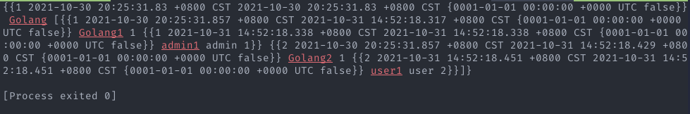

# gorm one2many

## 初始化数据库并创建 Tag

```go
package main

import (
	"log"

	"gorm.io/driver/mysql"
	"gorm.io/gorm"
)

type Article struct {
	gorm.Model
	Name  string
	TagID int
}

type Tag struct {
	gorm.Model
	Name     string
	Articles []Article
}

var (
	Db  *gorm.DB
	err error
)

func init() {
	dsn := "rey:1@tcp(121.40.151.71:3306)/one2many?charset=utf8mb4&parseTime=True&loc=Local"
	Db, err = gorm.Open(mysql.Open(dsn), &gorm.Config{})
	if err != nil {
		log.Fatalln(err)
	}
}

func main() {
	Db.AutoMigrate(&Tag{}, &Article{})

	a1 := Article{Model: gorm.Model{ID: 1}, Name: "Golang1"}
	a2 := Article{Model: gorm.Model{ID: 2}, Name: "Golang2"}
	t := Tag{Model: gorm.Model{ID: 1}, Name: "Golang", Articles: []Article{a1, a2}}

	Db.Create(&t)
}

```

初始化后数据库结构:


gorm 自动为我们创建两个 Article 并与 Tag 产生关联.

### 查询关联 Select with Preload

1. 查询所有的关联

   1. Without preload

   ```go
   func main() {
     Db.AutoMigrate(&Tag{}, &Article{})

     //a1 := Article{Model: gorm.Model{ID: 1}, Name: "Golang1"}
     //a2 := Article{Model: gorm.Model{ID: 2}, Name: "Golang2"}
     //t := Tag{Model: gorm.Model{ID: 1}, Name: "Golang", Articles: []Article{a1, a2}}

     var tag Tag
     Db.First(&tag)
     fmt.Println(tag)

   }
   ```

   并没有得到携带的 Articles 的信息.

   

   2. Preload

   ```go
   func main() {
     Db.AutoMigrate(&Tag{}, &Article{})

     //a1 := Article{Model: gorm.Model{ID: 1}, Name: "Golang1"}
     //a2 := Article{Model: gorm.Model{ID: 2}, Name: "Golang2"}
     //t := Tag{Model: gorm.Model{ID: 1}, Name: "Golang", Articles: []Article{a1, a2}}

     var tag Tag
     Db.Preload("Articles").First(&tag)
     fmt.Println(tag)
   }
   ```

   成功得到携带的 Articles 信息

   

2. 查询部分携带信息 (带条件的预加载)

   1. 带条件的预加载

   ```go
   func main() {
     Db.AutoMigrate(&Tag{}, &Article{})

     //a1 := Article{Model: gorm.Model{ID: 1}, Name: "Golang1"}
     //a2 := Article{Model: gorm.Model{ID: 2}, Name: "Golang2"}
     //t := Tag{Model: gorm.Model{ID: 1}, Name: "Golang", Articles: []Article{a1, a2}}

     var tag Tag
     Db.Preload("Articles", "id = ?", "2").First(&tag)
     fmt.Println(tag)
   }

   ```

   查询结果只含有我们需要的携带信息, 这里是 id=2 的 article.

   

   2. 使用函数进行带条件的预加载

   ```go
   func main() {
     Db.AutoMigrate(&Tag{}, &Article{})

     //a1 := Article{Model: gorm.Model{ID: 1}, Name: "Golang1"}
     //a2 := Article{Model: gorm.Model{ID: 2}, Name: "Golang2"}
     //t := Tag{Model: gorm.Model{ID: 1}, Name: "Golang", Articles: []Article{a1, a2}}

     var tag Tag

     Db.Preload("Articles", func(db *gorm.DB) *gorm.DB {
       return db.Where("id = ?", "2")
     }).Find(&tag)

     fmt.Println(tag)
   }
   ```

   查询结果与上方一致.

## 链式查询

### 准备 Author 表并自动迁移

设想一个场景, 每一个文章都有一个作者, 这里可以看作是一个 has one 的关系(尽管这样的结构可能并不严谨), 所以依照 has one 的模式, 给 Article 和 Author 添加相关属性.

```go

package main

import (
	"log"

	"gorm.io/driver/mysql"
	"gorm.io/gorm"
)

type Article struct {
	gorm.Model
	Name   string
	TagID  int
	Author Author
}

type Tag struct {
	gorm.Model
	Name     string
	Articles []Article
}

type Author struct {
	gorm.Model
	Name      string
	Role      string `gorm:"default:user"`
	ArticleID int
}

var (
	Db  *gorm.DB
	err error
)

func init() {
	dsn := "rey:1@tcp(121.40.151.71:3306)/one2many?charset=utf8mb4&parseTime=True&loc=Local"
	Db, err = gorm.Open(mysql.Open(dsn), &gorm.Config{})
	if err != nil {
		log.Fatalln(err)
	}
}

func main() {
	Db.AutoMigrate(&Tag{}, &Article{}, &Author{})
}
```

迁移后的数据库:


### 创建 Author 并与 Article 绑定

```go
func main() {
	Db.AutoMigrate(&Tag{}, &Article{}, &Author{})

	a1 := Article{Model: gorm.Model{ID: 1}, Name: "Golang1"}
	a2 := Article{Model: gorm.Model{ID: 2}, Name: "Golang2"}

	auth1 := Author{Model: gorm.Model{ID: 1}, Name: "admin1", Role: "admin"}
	auth2 := Author{Model: gorm.Model{ID: 2}, Name: "user1"}

	Db.Model(&a1).Association("Author").Append(&auth1)
	Db.Model(&a2).Association("Author").Append(&auth2)
}

```

创建两个 author, 分别与两个 article 使用 append 关联进行绑定.

绑定后的数据库:


### 进行链式查询

1. 查看 1 号 tag 的信息 包含所有 1 号 tag 下 article 的信息及其作者信息.

```go
func main() {
	Db.AutoMigrate(&Tag{}, &Article{}, &Author{})

	//a1 := Article{Model: gorm.Model{ID: 1}, Name: "Golang1"}
	//a2 := Article{Model: gorm.Model{ID: 2}, Name: "Golang2"}

	//t := Tag{Model: gorm.Model{ID: 1}, Name: "Golang", Articles: []Article{a1, a2}}

	//auth1 := Author{Model: gorm.Model{ID: 1}, Name: "admin1", Role: "admin"}
	//auth2 := Author{Model: gorm.Model{ID: 2}, Name: "user1"}

	//Db.Model(&a1).Association("Author").Append(&auth1)
	//Db.Model(&a2).Association("Author").Append(&auth2)

	var tag Tag
	Db.Preload("Articles.Author").Preload("Articles").Find(&tag)
	fmt.Println(tag)
}
```

可以看到所有的信息均已被正确查询出来.



2. 查询 tag 信息, 如果文章的作者不是 admin, 则文章信息中不要出现作者信息.

```go
func main() {
	Db.AutoMigrate(&Tag{}, &Article{}, &Author{})

	//a1 := Article{Model: gorm.Model{ID: 1}, Name: "Golang1"}
	//a2 := Article{Model: gorm.Model{ID: 2}, Name: "Golang2"}

	//t := Tag{Model: gorm.Model{ID: 1}, Name: "Golang", Articles: []Article{a1, a2}}

	//auth1 := Author{Model: gorm.Model{ID: 1}, Name: "admin1", Role: "admin"}
	//auth2 := Author{Model: gorm.Model{ID: 2}, Name: "user1"}

	//Db.Model(&a1).Association("Author").Append(&auth1)
	//Db.Model(&a2).Association("Author").Append(&auth2)

	var tag Tag
	Db.Preload("Articles.Author", "role = ?", "admin").Preload("Articles").Find(&tag)
	fmt.Println(tag)

}
```

可以看到, role 不为 admin 的 a2 的信息中并不包含文章信息.


3. 只查询 1 号 tag 中的 admin 文章信息.(作者不是 admin 的文章不出现)

```go
func main() {
	Db.AutoMigrate(&Tag{}, &Article{}, &Author{})

	//a1 := Article{Model: gorm.Model{ID: 1}, Name: "Golang1"}
	//a2 := Article{Model: gorm.Model{ID: 2}, Name: "Golang2"}

	//t := Tag{Model: gorm.Model{ID: 1}, Name: "Golang", Articles: []Article{a1, a2}}

	//auth1 := Author{Model: gorm.Model{ID: 1}, Name: "admin1", Role: "admin"}
	//auth2 := Author{Model: gorm.Model{ID: 2}, Name: "user1"}

	//Db.Model(&a1).Association("Author").Append(&auth1)
	//Db.Model(&a2).Association("Author").Append(&auth2)

	var tag Tag
	Db.Preload("Articles", func(db *gorm.DB) *gorm.DB {
		return db.Joins("Author").Where("role = ?", "admin")
	}).Find(&tag)
	fmt.Println(tag)

}

```

可以看到作者不是 admin 的文章信息没有被查询出来.


4. 总结

preload 直接决定这个属性是否被携带.

例 2 中, preload 完整的 article,只对 author 信息做了 condition, 所以 article 会完全携带出来,其属性 author 信息则根据 condition 决定是否被携带.

例 3 中, 对 article 做了 condition, 所以 article 是否被携带取决于 condition 条件是否满足.
