[TOC]

# Gorm one2one

## Belong to

建立 Article 与 Tag 模型, Article 属于某一种 Tag 类型, 并且一个 Tag 对应 一个 Article (1 2 1).

```go
package main

import (
	"log"

	"gorm.io/driver/mysql"
	"gorm.io/gorm"
)

type Article struct {
	gorm.Model
	Name  string
	TagID int
	Tag   Tag
}

type Tag struct {
	gorm.Model
	Name string
}

var (
	Db  *gorm.DB
	err error
)

func init() {
	dsn := "rey:1@tcp(121.40.151.71:3306)/one2one?charset=utf8mb4&parseTime=True&loc=Local"
	Db, err = gorm.Open(mysql.Open(dsn), &gorm.Config{})
	if err != nil {
		log.Fatalln(err)
	}
}

func main() {
	Db.AutoMigrate(&Tag{}, &Article{})
}
```

自动迁移后的数据库:

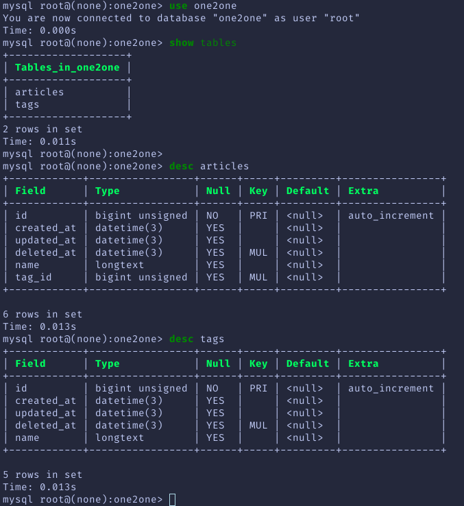

### 创建 Article

Warning: 创建 Article 时不需要初始化 TagID, gorm 会自动进行关联.

```go
func main() {
	Db.AutoMigrate(&Tag{}, &Article{})

	t := Tag{Model: gorm.Model{ID: 1}, Name: "Golang"}
	a := Article{Model: gorm.Model{ID: 1}, Tag: t, Name: "Practical Golang"}

	Db.Create(&a)
}
```

数据库的情况:
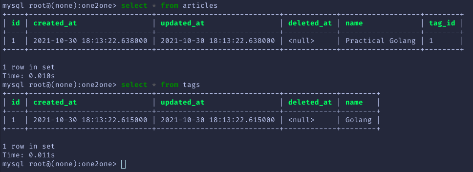

可以看到 gorm 自动创建了 id 为 1, name 为 practical Golang 的 tag, 并与 article 关联了起来.

### 查询 Select

1. 直接查询 ❌

```go
func main() {
	Db.AutoMigrate(&Tag{}, &Article{})

	//t := Tag{Model: gorm.Model{ID: 1}, Name: "Golang"}
	//a := Article{Model: gorm.Model{ID: 1}, Tag: t, Name: "Practical Golang"}

	var art Article
	Db.Where("id = ?", 1).First(&art)
	fmt.Printf("%#v", art)
}
```

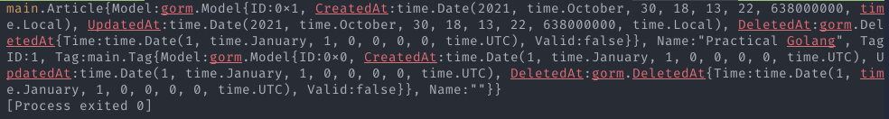

可以看到得到的 Tag 信息是不正确的, 不正确的时间与 name.

2. Preload ✅

```go
func main() {
	Db.AutoMigrate(&Tag{}, &Article{})

	//t := Tag{Model: gorm.Model{ID: 1}, Name: "Golang"}
	//a := Article{Model: gorm.Model{ID: 1}, Tag: t, Name: "Practical Golang"}

	var art Article
	Db.Preload("Tag").Where("id = ?", 1).First(&art)
	fmt.Printf("%#v", art)
}
```

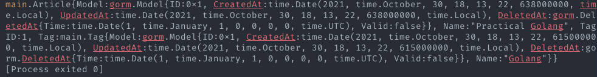
得到了正确的时间信息与 name.

### 置换关联 replace

```go
func main() {
	Db.AutoMigrate(&Tag{}, &Article{})

	t := Tag{Model: gorm.Model{ID: 1}, Name: "Golang"}
	a := Article{Model: gorm.Model{ID: 1}, Tag: t, Name: "Practical Golang"}

	t2 := Tag{Model: gorm.Model{ID: 2}, Name: "Golang  for beginner"}

	Db.Create(&t2)

	Db.Model(&a).Association("Tag").Replace(&t, &t2)

	var art Article
	Db.Preload("Tag").Where("id = ?", 1).First(&art)
	fmt.Printf("%#v", art)
}
```

创建另一个 Tag, 并在 a 模型上使用 replace 的方式与 t2 添加关联.

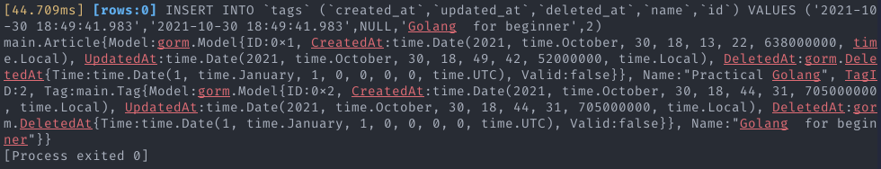

数据库:

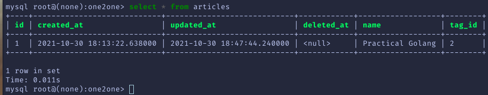

可以看到 a 已经与 t2 建立关联.

### 清除关联 clear

```go
func main() {
	Db.AutoMigrate(&Tag{}, &Article{})

	t := Tag{Model: gorm.Model{ID: 1}, Name: "Golang"}
	a := Article{Model: gorm.Model{ID: 1}, Tag: t, Name: "Practical Golang"}

	//t2 := Tag{Model: gorm.Model{ID: 2}, Name: "Golang  for beginner"}

	Db.Model(&a).Association("Tag").Clear()

	var art Article
	Db.Preload("Tag").Where("id = ?", 1).First(&art)
	fmt.Printf("%#v", art)
}
```

清除所有关联.

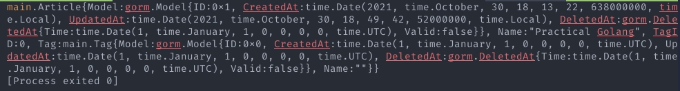

数据库:

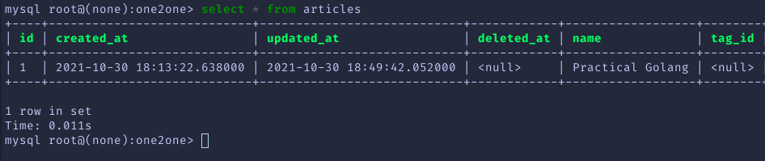

### 添加关联 append

```go
func main() {
	Db.AutoMigrate(&Tag{}, &Article{})

	t := Tag{Model: gorm.Model{ID: 1}, Name: "Golang"}
	a := Article{Model: gorm.Model{ID: 1}, Tag: t, Name: "Practical Golang"}

  t2 := Tag{Model: gorm.Model{ID: 2}, Name: "Golang  for beginner"}

	Db.Model(&a).Association("Tag").Append(&t2)

	var art Article
	Db.Preload("Tag").Where("id = ?", 1).First(&art)
	fmt.Printf("%#v", art)
}
```

又重新与 t2 关联.

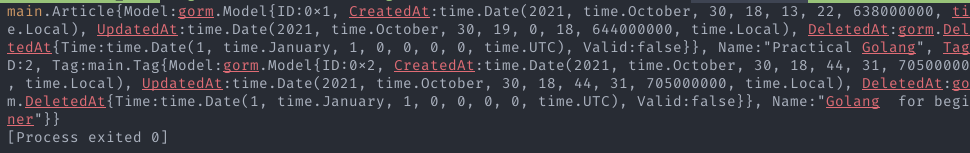

数据库:

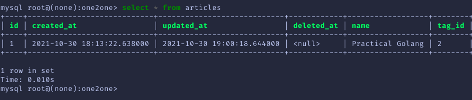

### 删除关联 delete

`Db.Model(&a).Association("Tag").Delete(&t)`

## Has one

删掉上面建立的表重新进行自动迁移

```go
package main

import (
	"log"

	"gorm.io/driver/mysql"
	"gorm.io/gorm"
)

type Article struct {
	gorm.Model
	Name  string
	TagID int
}

type Tag struct {
	gorm.Model
	Name    string
	Article Article
}

var (
	Db  *gorm.DB
	err error
)

func init() {
	dsn := "rey:1@tcp(121.40.151.71:3306)/one2one?charset=utf8mb4&parseTime=True&loc=Local"
	Db, err = gorm.Open(mysql.Open(dsn), &gorm.Config{})
	if err != nil {
		log.Fatalln(err)
	}
}

func main() {
	Db.AutoMigrate(&Tag{}, &Article{})
}
```

迁移后的数据库:
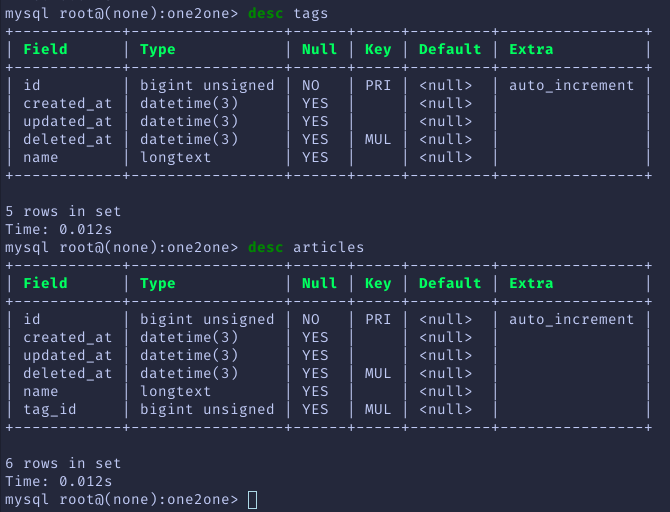

### 创建 Tag

```go
func main() {
	Db.AutoMigrate(&Tag{}, &Article{})

	a := Article{Model: gorm.Model{ID: 1}, Name: "Practical Golang"}
	t := Tag{Model: gorm.Model{ID: 1}, Name: "Golang", Article: a}

	Db.Create(&t)
}

```

可以看到创建 Tag 时, gorm 自动创建了 Article 并与 Tag 完成了关联.

数据库:

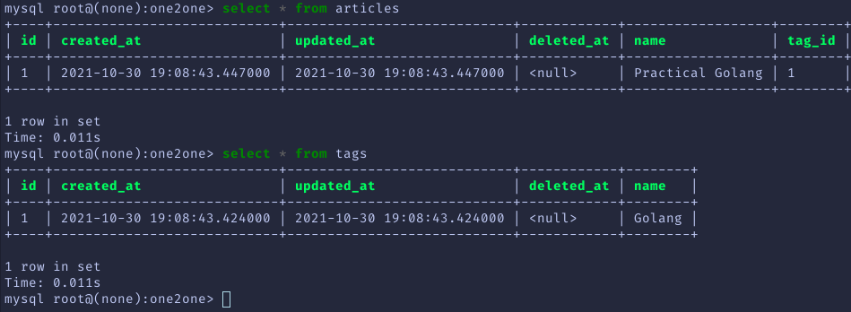

### 查询 Select

同样的使用 preload

```go
func main() {
	Db.AutoMigrate(&Tag{}, &Article{})

	//a := Article{Model: gorm.Model{ID: 1}, Name: "Practical Golang"}
	//t := Tag{Model: gorm.Model{ID: 1}, Name: "Golang", Article: a}

	var tag Tag
	Db.Preload("Article").Where("id = ?", 1).First(&tag)
	fmt.Printf("%#v", tag)
}
```

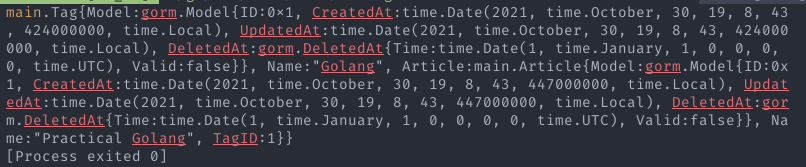

可以看到正确的得到了相关联的文章

### 替换关联 replace

```go
func main() {
	Db.AutoMigrate(&Tag{}, &Article{})

	a := Article{Model: gorm.Model{ID: 1}, Name: "Practical Golang"}
	t := Tag{Model: gorm.Model{ID: 1}, Name: "Golang", Article: a}
	a2 := Article{Model: gorm.Model{ID: 2}, Name: "Leaning Golang"}

	Db.Create(&a2)

	Db.Model(&t).Association("Article").Replace(&a, &a2)

	var tag Tag
	Db.Preload("Article").Where("id = ?", 1).First(&tag)
	fmt.Printf("%#v", tag)
}
```

创建第二个文章 a2, 并替换 a 与 t 建立关联.

输出:

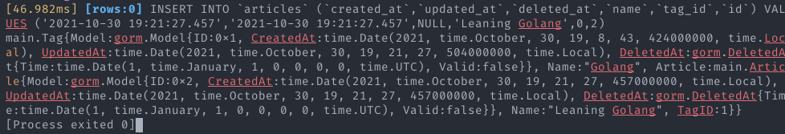

数据库:

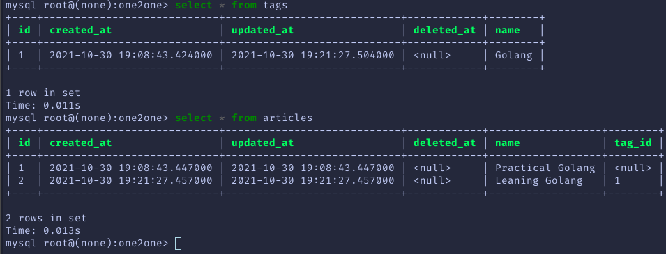

可以看到 a 已经不与任何 tag 相关联, a2 与 t 相关联.

### 清除关联 clear

```go
func main() {
	Db.AutoMigrate(&Tag{}, &Article{})

	a := Article{Model: gorm.Model{ID: 1}, Name: "Practical Golang"}
	t := Tag{Model: gorm.Model{ID: 1}, Name: "Golang", Article: a}
	//a2 := Article{Model: gorm.Model{ID: 2}, Name: "Leaning Golang"}

	//Db.Create(&a2)

	Db.Model(&t).Association("Article").Clear()

	var tag Tag
	Db.Preload("Article").Where("id = ?", 1).First(&tag)
	fmt.Printf("%#v", tag)
}

```

已清除关联

输出:

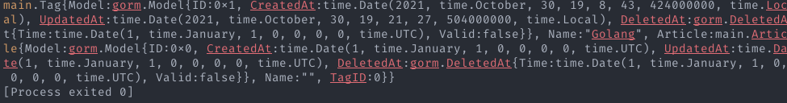

数据库:

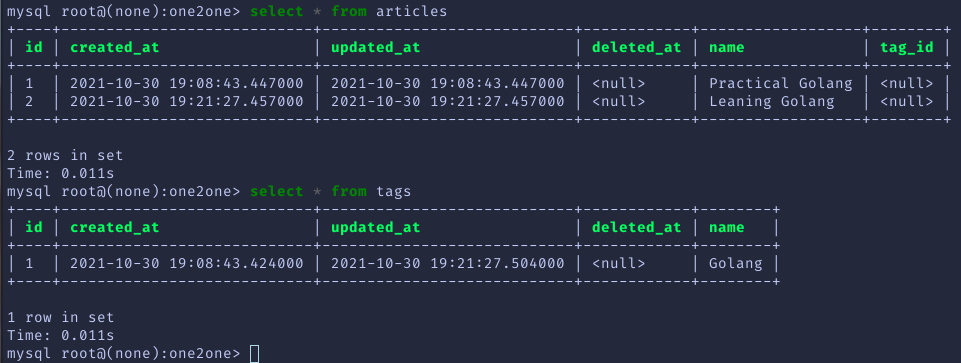

### 添加关联 append

```go
func main() {
	Db.AutoMigrate(&Tag{}, &Article{})

	a := Article{Model: gorm.Model{ID: 1}, Name: "Practical Golang"}
	t := Tag{Model: gorm.Model{ID: 1}, Name: "Golang", Article: a}
	a2 := Article{Model: gorm.Model{ID: 2}, Name: "Leaning Golang"}

	//Db.Create(&a2)

	Db.Model(&t).Association("Article").Append(&a2)

	var tag Tag
	Db.Preload("Article").Where("id = ?", 1).First(&tag)
	fmt.Printf("%#v", tag)
}
```

重新与 a2 建立关联

输出:

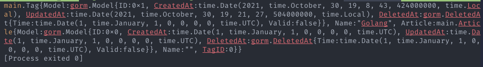

数据库:

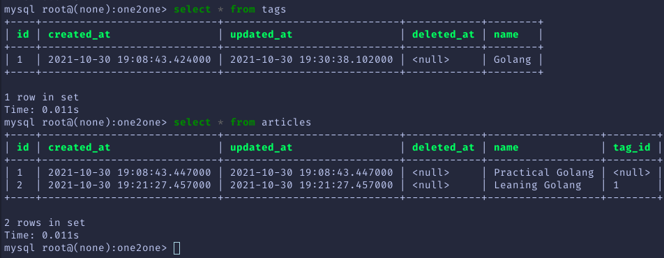

### 删除关联 delete

`Db.Model(&t).Association("Tag").Delete(&a)`
